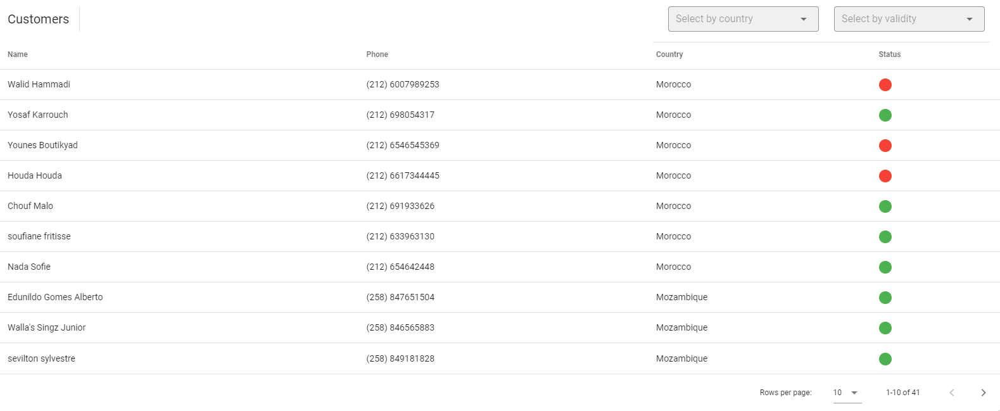
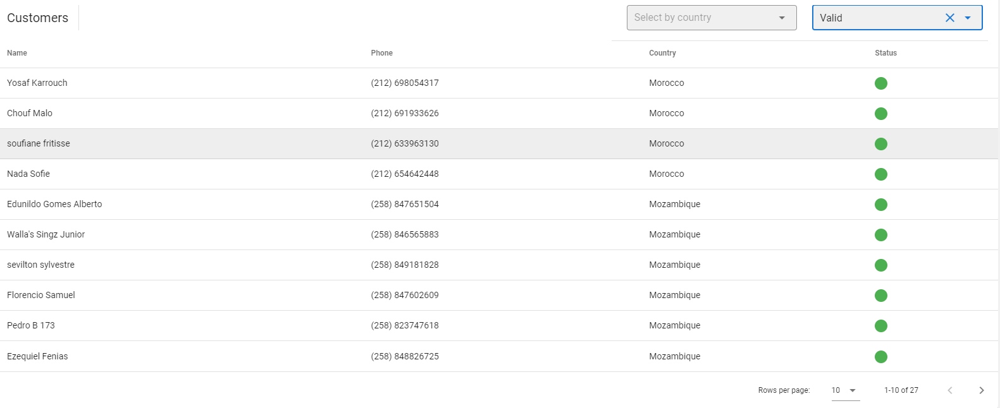
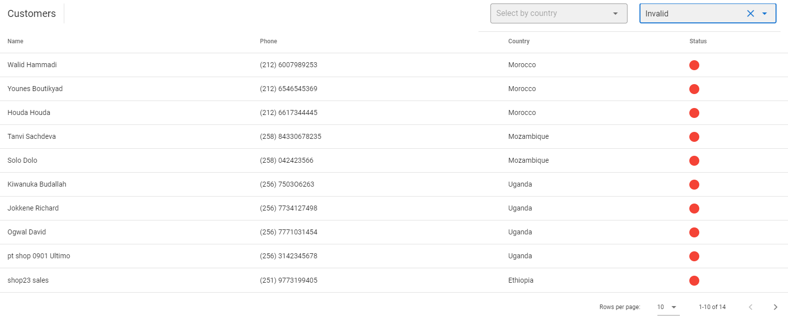
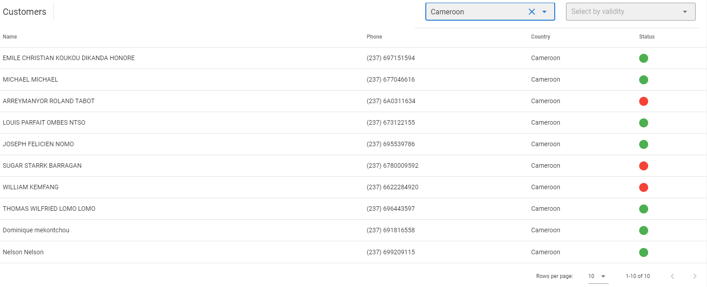
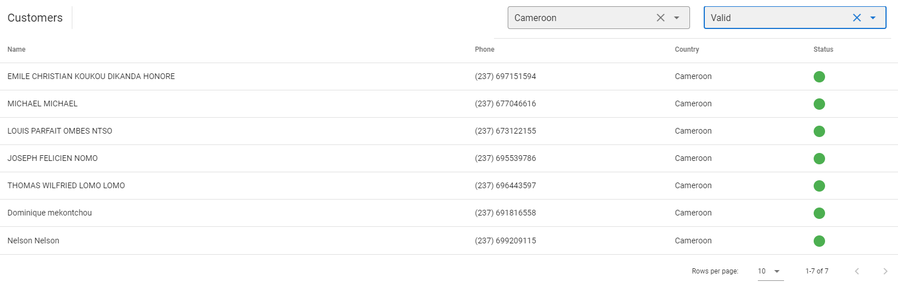
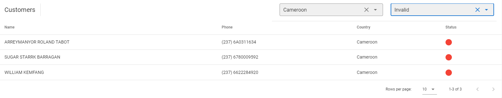
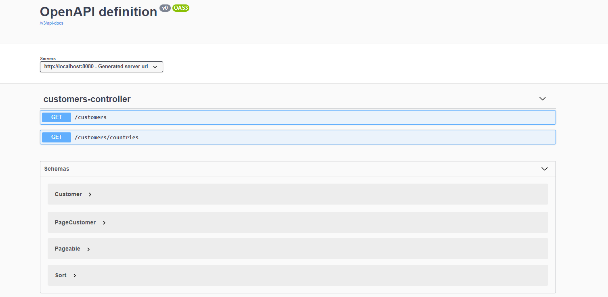

# Customers phonebook

A single page application that displays customers info such as their name, country, phone number and its validity.

## Technologies & Frameworks used for development

* Frontend: VueJs
* Backend: Spring Boot

## Version info

Frontend

* VueJs: v2.6.11
* Node: v12.13.1
* Vuetify: v2.4.0

Backend

* JDK: 1.8
* Maven: 3.6.2
* Spring Boot: 2.5.5
* Sqlite: 3.16.1
* Jackson object mapper: 2.12.5
* Model mapper: 2.4.4
* Spring doc-openapi: 1.5.2

## Task requirements

It was required to create a page that displays customers info such as name, phone number, country and number's validity.

* Implement Filtering by country, phone number validity or both.
* Implement Pagination, Sorting by name and phone (bonus requirement).
* Add API documentation (bonus requirement).
* Add unit test for services.
* Dockerize the project.

## Available data

* A sqlite database file with customers data [sample.db].
* A json file with countries info (country name, country code, phone validity rule)
  [customers.json](https://github.com/AhmedIbrahim12/Phonebook/blob/master/backend/src/main/resources/countries.json).

## Challenges

* Customers table doesn't store the validity of the phone number and needs to be validated against a set of rules provided for
  each country to determine it.
    * One approach is that in case of validity filtering all records should be fetched then validated and paginated at the service
      layer.
    * The chosen approach was to fetch only the filtered records using "REGEXP" and handle the pagination and sorting at DAO
      layer.
        * As per this [comment](https://github.com/xerial/sqlite-jdbc/issues/60#issuecomment-271064901) sqlite currently doesn't
          support "REGEXP", so a workaround was registering the REGEXP as a UDF.
          See [CustomeDataSource](https://github.com/AhmedIbrahim12/Phonebook/blob/master/backend/src/main/java/com/jumia/customers/config/CustomDataSource.java)
          for registering the REGEXP for usage.

## Enhancements plan for existing code

* Add more validations on the backend.
* Securing the endpoints.

## Dockerizing the app

* An alpine based openJDK 8 image was used to dockerize the application.

## How to run the project

1. Clone the project
   ```sh
   git clone https://github.com/AhmedIbrahim12/Phonebook.git
   ```
2. Move to /Phonebook and run
   ```sh
   mvn clean package
   ```
3. Move to /Phonebook/backend and run
   ```sh
   docker-compose up

4. The application is now up and can be accessed via
   ```sh
   http://localhost:8080/
5. API Documentation can be accessed via
   ```sh
   http://localhost:8080/swagger-ui.html

## Run samples

* Unfiltered paginated result
  

* Only valid
  

* Only invalid
  

* Filter by country (Cameroon)
  

* Filter by country (Cameroon) and only valid
  

* Filter by country (Cameroon) and only invalid
  

* Swagger API Documentation
  